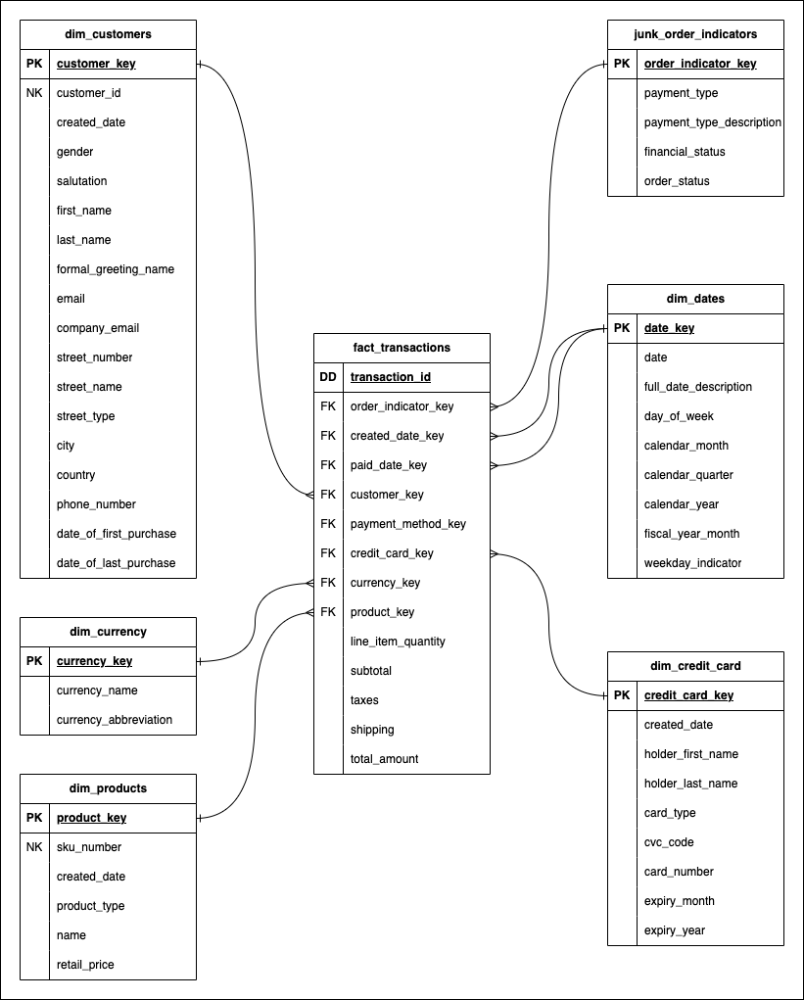

# SLAMCO

SLAMCO is a retail company that offers a wide range of products to meet all your
shopping needs. With a diverse selection of goods, including groceries,
clothing and electronics, SLAMCO is your one-stop shop for all your shopping
desires.

You have just been hired as a senior data engineer for SLAMCO! Your first task
is to model the company's order data for the sales team.

## Tables

| Database | Schema | Table Name   | Description                       |
| -------- | ------ | ------------ | -----------                       |
| raw      | slamco | customers    | SLAMCO's registered customer base |
| raw      | slamco | products     | SLAMCO's current product offering |
| raw      | slamco | billing      | SLAMCO's user payment information |
| raw      | slamco | Orders       | SLAMCO's raw retail orders        |

### Customers

| Attribute         | Description                       |
| ----------------- | --------------------------------- |
| `customer_id`     | The primary key                   |
| `created_date`    | The record created date           |
| `gender`          | Customer gender                   |
| `prefix`          | Customer salutation               |
| `first_name`      | Customer's first name             |
| `last_name`       | Customer's surname                |
| `email`           | Customer's personal email address |
| `company_email`   | Customer's company email address  |
| `building_number` | Shipping address building number  |
| `street_name`     | Shipping address street name      |
| `street_suffix`   | Shipping address street suffix    |
| `city`            | Shipping city                     |
| `postcode`        | Shipping postcode                 |
| `country`         | Shipping country                  |
| `phone_number`    | Customer phone number             |

### Products

| Attribute       | Description                     |
| --------------- | ------------------------------- |
| `product_id`    | The primary key                 |
| `created_date`  | The record created date         |
| `product_sku`   | The unique product sku          |
| `product_type`  | The product group               |
| `product_name`  | The name of the product         |
| `product_price` | The retail price of the product |

### Billing

| Attribute                   | Description                        |
| --------------------------- | ---------------------------------- |
| `billing_id`                | The primary key                    |
| `customer_id`               | The customer id of the credit card |
| `created_date`              | The record created date            |
| `credit_card_provider`      | The credit card provider           |
| `credit_card_security_code` | The credit card CVC code           |
| `credit_card_number`        | The credit card number             |
| `credit_card_expiry_date`   | The credit card expiry date        |

### Orders

| Attribute            | Description                               |
| -------------------- | ----------------------------------------- |
| `transaction_id`     | The primary key                           |
| `customer_id`        | Customer id who made the transaction      |
| `created_date`       | Transaction date                          |
| `paid_date`          | Transaction paid date                     |
| `payment_method`     | The payment method used                   |
| `order_status`       | The order status                          |
| `line_item_sku`      | The ordered line item SKU                 |
| `line_item_name`     | The order line item name                  |
| `line_item_quantity` | The quantity ordered                      |
| `line_item_price`    | The price of a single item                |
| `financial_status`   | The payment status                        |
| `subtotal`           | The total price before shipping and taxes |
| `taxes`              | The amount of GST paid                    |
| `shipping`           | The amount paid for shipping              |
| `total`              | The total price after shipping and taxes  |
| `currency_code`      | The code of the currency used to pay      |
| `currency_name`      | The name of the currenc used to pay       |

## Dimensional Model

After speaking to the business and reviewing the source data, you decide on the
following dimensional model.

  

