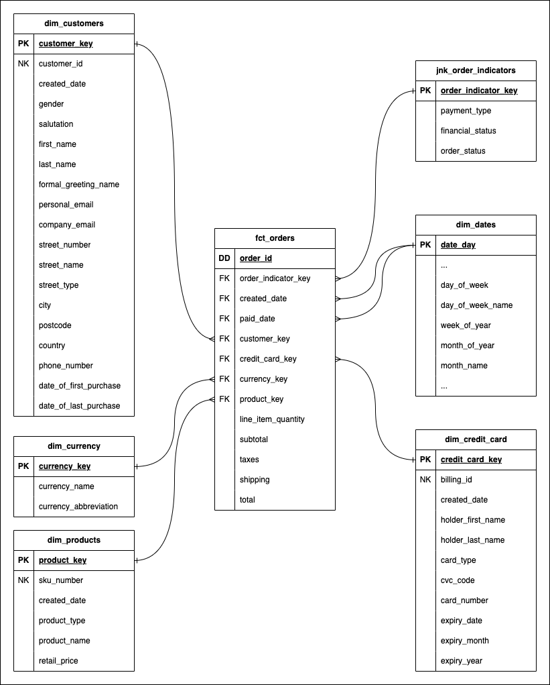

# SLAMCO

SLAMCO is a retail company that offers a wide range of products to meet all your
shopping needs. With a diverse selection of goods, including groceries,
clothing and electronics, SLAMCO is your one-stop shop for all your shopping
desires.

You have just been hired as a senior data engineer for SLAMCO! Your first task
is to model the company's transaction data for the sales team.

## Tables

| Database | Schema | Table Name   | Description                       |
| -------- | ------ | ------------ | -----------                       |
| raw      | slamco | users        | SLAMCO's registered user base     |
| raw      | slamco | products     | SLAMCO's current product offering |
| raw      | slamco | billing      | SLAMCO's user payment information |
| raw      | slamco | transactions | SLAMCO's raw retail transactions  |

## Dimensional Model

After speaking to the business and reviewing the source data, you decide on the
following dimensional model.

  

